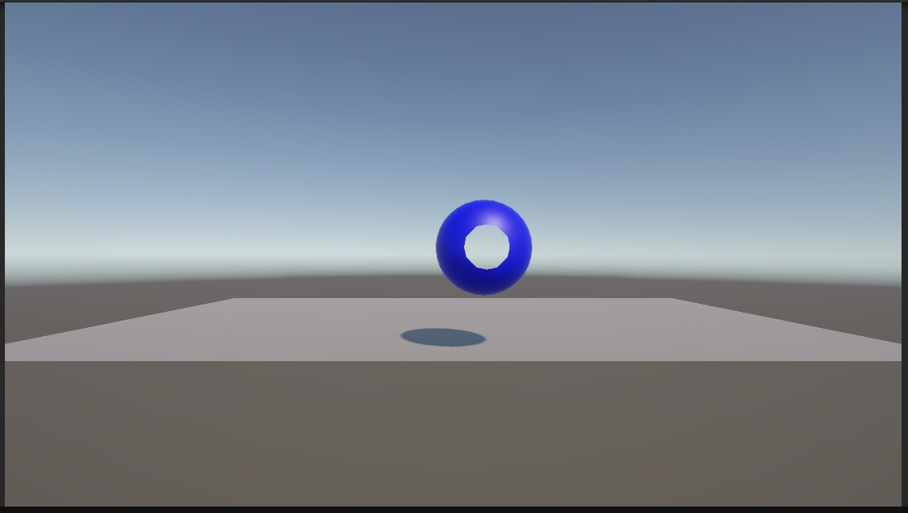
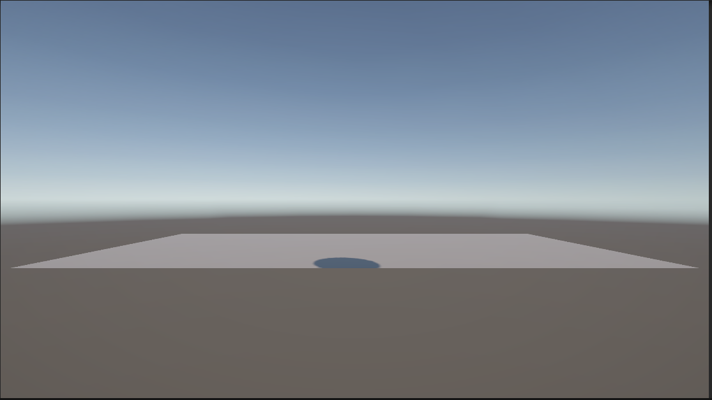
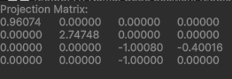
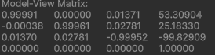
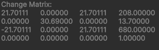
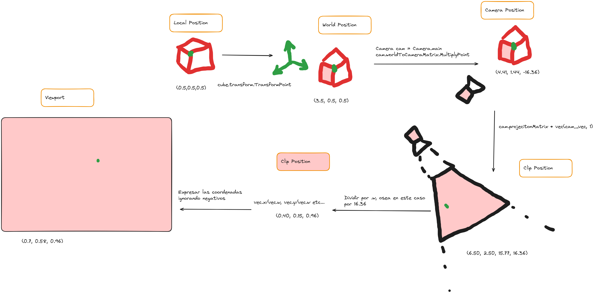

# Interfaces Inteligentes
## Seminario 3: Mundos virtuales. Introducción a la programación de gráficos 3D.
### Grupo 12:
- Alejandro Miguel Cruz Quiralte
- Nailea Fayna Cruz Galván
- Sara Darias Sánchez
- Abián Santana Ledesma

**Descripción:**
En este seminario se nos propone responder a una serie de cuestiones relacionandas con los contenidos tratados durante la sesión de Mundos Virtuales.

### Cuestiones
---

1. **¿Qué funciones se pueden usar en los scripts de Unity para llevar a cabo traslaciones, rotaciones y escalados?**

Para traslaciones:
- transform.position Asigna una posición absoluta en el espacio 3D
- transform.Translate(Vector3 desplazamiento) Suma a la posición actual del objeto cada coordenada del vector pasado como argumento

Para rotaciones:
- transform.rotation = Quaternion.Euler(x, y, z) Rotación absoluta en grados
- transform.Rotate(Vector3 ángulos) Rotación sumada a la rotación actual del objeto

Para escalado:
- transform.localScale Ajusta el tamaño en cada eje


2. **Como trasladarías la cámara 2 metros en cada uno de los ejes y luego la rotas 30º alrededor del eje Y?. Rota la cámara alrededor del eje Y 30ª y desplázala 2 metros en cada uno de los ejes. ¿Obtendrías el mismo resultado en ambos casos?. Justifica el resultado**

1 -> `transform.position += new Vector3(2f, 2f, 2f);` 

  `transform.Rotate(0, 30f, 0);`

2 -> `transform.Rotate(0, 30f, 0);`

   `transform.position += new Vector3(2f, 2f, 2f);`

El resultado no es el mismo ya que en el primer caso se mueve en la dirección marcada como “adelante” y posteriormente rota. Al contrario que el segundo caso, en el cual antes de moverse cambia esa cara(al rotar) y por ende la dirección y ya después ejecuta el desplazamiento en esa dirección.

3. **Sitúa la esfera de radio 1 en el campo de visión de la cámara y configura un volumen de vista que la recorte parcialmente.**




4. **Sitúa la esfera de radio 1 en el campo de visión de la cámara y configura el volumen de vista para que la deje fuera de la vista.**



5. **Como puedes aumentar el ángulo de la cámara. Qué efecto tiene disminuir el ángulo de la cámara.**
Con el método `camera.fieldOfView` se controla el ángulo de la visión de la cámara.
- Aumentar el ángulo ( `> fieldOfView` ): la visión es más abierta, más objetos entran en el campo visual pero se distorsionan en mayor medida
- Disminuir el ángulo ( `< fieldOfView` ): se obtiene un efecto zoom, se ve menos área pero los objetos se ven más grandes y menos distorsionados


6. **Es correcta la siguiente afirmación: Para realizar la proyección al espacio 2D, en el inspector de la cámara, cambiaremos el valor de projection, asignándole el valor de orthographic**
Sí, la afirmación es correcta. Si cambiamos la propiedad Projection de la cámara a Orthographic en el inspector de Unity, la cámara generará una vista sin perspectiva, que  muestra los objetos del mismo tamaño obviando la distancia a la que estén situados. En  el modo ortográfico, el espacio de visionado se comporta como una caja rectangular, mientras que en perspectiva lo hace en forma de pirámide truncada, causando que los objetos lejanos se vean más pequeños.

7. **Especifica las rotaciones que se han indicado en los ejercicios previos con la utilidad quaternion.**

En el ejercicio 2, se pedía rotar la cámara 30º alrededor del eje Y. Usando quaterniones, esas rotaciones pueden especificarse así:

- Rotación absoluta de 30º alrededor del eje Y
  - `transform.rotation = Quaternion.AngleAxis(30f, Vector3.up);`
- Sumandole 30º a la rotación actual (rotación relativa)
  - `transform.rotation *= Quaternion.AngleAxis(30f, Vector3.up);`


8. **¿Como puedes averiguar la matriz de proyección en perspectiva que se ha usado para proyectar la escena al último frame renderizado?.**

En Unity, cada cámara tiene asociada una matriz de proyección. Para averiguar la matriz de proyección en perspectiva usada por la cámara en el último frame renderizado, podemos acceder a la propiedad `projectionMatrix` del componente Camera.

`Matrix4x4 perspectiveMatrix = Camera.main.projectionMatrix;`


9. **¿Como puedes averiguar la matriz de proyección en perspectiva ortográfica que se ha usado para proyectar la escena al último frame renderizado?.**

Cuando la cámara está en modo ortográfico, Unity genera una matriz ortográfica en lugar de una de perspectiva (al contrario que el anterior apartado). Sin embargo, la forma de obtenerla es exactamente la misma. La única diferencia es que nos tenemos que asegurar que la cámara está en modo ortográfico.

`Matrix4x4 orthoMatrix = Camera.main.projectionMatrix;`

10. **¿Cómo puedes obtener la matriz de transformación entre el sistema de coordenadas local y el mundial?.**

Esta matriz convierte cualquier punto en coordenadas locales al espacio mundial, y podemos obtenerla mediante la siguiente propiedad:

`Matrix4x4 localToWorld = transform.localToWorldMatrix;`

11. **Cómo puedes obtener la matriz para cambiar al sistema de referencia de vista**

Esta matriz convierte las coordenadas del mundo al espacio de vista, que es el sistema de coordenadas de la cámara. La cámara tiene una propiedad que almacena esta matriz, así que podemos obtenerla de esta manera:

`Matrix4x4 viewMatrix = Camera.main.worldToCameraMatrix;`


12. **Especifica la matriz de la proyección usado en un instante de la ejecución del ejercicio 1 de la práctica 1.**  

13. **Especifica la matriz de modelo y vista de la escena del ejercicio 1 de la práctica 1.**  

14. **Aplica una rotación en el start de uno de los objetos de la escena y muestra la matriz de cambio al sistema de referencias mundial.**  

15. **¿Como puedes calcular las coordenadas del sistema de referencia de un objeto con las siguientes propiedades del Transform?: Position (3, 1, 1), Rotation (45, 0, 45)**  
Para calcular las coordenadas del sistema de referencia de un objeto en Unity usando sus propiedades del Transform (position, rotation y scale), se puede aplicar la matriz de transformación generada por estas propiedades. En Unity, las propiedades Position, Rotation, y Scale se combinan para formar la matriz de transformación localToWorldMatrix, que define cómo pasar las coordenadas del sistema de referencia local, el del objeto, a coordenadas en el sistema de referencia mundial.

16. **Crea una escena en Unity con los siguientes elementos: cámara principal, plano base (como suelo) y tres cubos de distinto color (rojo, verde, azul) colocados en posiciones distintas en el espacio. Realiza un pequeño script de depuración adjunto a la cámara que permita visualizar en consola o en pantalla las matrices de transformación (Model, View, Projection) y sus resultados sobre un vértice de cada cubo.**

Para ver el código mire el [código](Assets/Scripts/Exercise%2016/Debugger.cs)

La salida de todos los elementos creados son:

```
model matrix (CubeRed):
1.00000	0.00000	0.00000	3.50000
0.00000	1.00000	0.00000	1.00000
0.00000	0.00000	1.00000	0.50000
0.00000	0.00000	0.00000	1.00000

UnityEngine.Debug:Log (object)
Debugger:PrintMatrixes (UnityEngine.Transform,string) (at Assets/Scripts/Exercise 16/Debugger.cs:31)
Debugger:Start () (at Assets/Scripts/Exercise 16/Debugger.cs:16)

view matrix (Cámara):
1.00000	0.00000	0.00000	0.91000
0.00000	0.90631	0.42262	0.32322
0.00000	0.42262	-0.90631	-16.33375
0.00000	0.00000	0.00000	1.00000

UnityEngine.Debug:Log (object)
Debugger:PrintMatrixes (UnityEngine.Transform,string) (at Assets/Scripts/Exercise 16/Debugger.cs:32)
Debugger:Start () (at Assets/Scripts/Exercise 16/Debugger.cs:16)

projection matrix (Cámara):
0.91401	0.00000	0.00000	0.00000
0.00000	1.73205	0.00000	0.00000
0.00000	0.00000	-1.00060	-0.60018
0.00000	0.00000	-1.00000	0.00000

UnityEngine.Debug:Log (object)
Debugger:PrintMatrixes (UnityEngine.Transform,string) (at Assets/Scripts/Exercise 16/Debugger.cs:33)
Debugger:Start () (at Assets/Scripts/Exercise 16/Debugger.cs:16)

model matrix (CubeGreen):
1.00000	0.00000	0.00000	0.50000
0.00000	1.00000	0.00000	1.00000
0.00000	0.00000	1.00000	5.50000
0.00000	0.00000	0.00000	1.00000

UnityEngine.Debug:Log (object)
Debugger:PrintMatrixes (UnityEngine.Transform,string) (at Assets/Scripts/Exercise 16/Debugger.cs:31)
Debugger:Start () (at Assets/Scripts/Exercise 16/Debugger.cs:17)

view matrix (Cámara):
1.00000	0.00000	0.00000	0.91000
0.00000	0.90631	0.42262	0.32322
0.00000	0.42262	-0.90631	-16.33375
0.00000	0.00000	0.00000	1.00000

UnityEngine.Debug:Log (object)
Debugger:PrintMatrixes (UnityEngine.Transform,string) (at Assets/Scripts/Exercise 16/Debugger.cs:32)
Debugger:Start () (at Assets/Scripts/Exercise 16/Debugger.cs:17)

projection matrix (Cámara):
0.91401	0.00000	0.00000	0.00000
0.00000	1.73205	0.00000	0.00000
0.00000	0.00000	-1.00060	-0.60018
0.00000	0.00000	-1.00000	0.00000

UnityEngine.Debug:Log (object)
Debugger:PrintMatrixes (UnityEngine.Transform,string) (at Assets/Scripts/Exercise 16/Debugger.cs:33)
Debugger:Start () (at Assets/Scripts/Exercise 16/Debugger.cs:17)

model matrix (CubeBlue):
1.00000	0.00000	0.00000	-4.50000
0.00000	1.00000	0.00000	1.00000
0.00000	0.00000	1.00000	0.50000
0.00000	0.00000	0.00000	1.00000

UnityEngine.Debug:Log (object)
Debugger:PrintMatrixes (UnityEngine.Transform,string) (at Assets/Scripts/Exercise 16/Debugger.cs:31)
Debugger:Start () (at Assets/Scripts/Exercise 16/Debugger.cs:18)

view matrix (Cámara):
1.00000	0.00000	0.00000	0.91000
0.00000	0.90631	0.42262	0.32322
0.00000	0.42262	-0.90631	-16.33375
0.00000	0.00000	0.00000	1.00000

UnityEngine.Debug:Log (object)
Debugger:PrintMatrixes (UnityEngine.Transform,string) (at Assets/Scripts/Exercise 16/Debugger.cs:32)
Debugger:Start () (at Assets/Scripts/Exercise 16/Debugger.cs:18)

projection matrix (Cámara):
0.91401	0.00000	0.00000	0.00000
0.00000	1.73205	0.00000	0.00000
0.00000	0.00000	-1.00060	-0.60018
0.00000	0.00000	-1.00000	0.00000

UnityEngine.Debug:Log (object)
Debugger:PrintMatrixes (UnityEngine.Transform,string) (at Assets/Scripts/Exercise 16/Debugger.cs:33)
Debugger:Start () (at Assets/Scripts/Exercise 16/Debugger.cs:18)
```

17. **Dibujar en un programa de dibujo el recorrido de las coordenadas de un vértice específico del cubo rojo:**
`Local → World → Camera/View → Clip → NDC → Viewport`. **Indicar cómo cambia su valor en cada espacio. Aplicar la transformación manualmente a un punto (por ejemplo, el vértice (0.5, 0.5, 0.5)) y registrar los resultados paso a paso.**



18. **Mover o rotar uno de los cubos y mostrar cómo cambian los valores de su matriz de modelo. Rotar la cámara y mostrar cómo se modifica la matriz de vista. Cambiar entre proyección ortográfica y perspectiva y comparar las diferencias numéricas en la matriz de proyección.**

Para ver el código mire el [código](Assets/Scripts/Exercise%2018/MatrixDebugger.cs)

El cúbo se puede mover con el wasd, mientras que la camara con las flechas además para rotar el cubo empleas la q, y la e. Por otro lado para cambiar de perspectiva necesito la p

Salida de ejemplo cuanod se mueve algún objeto

```
Model Matrix (Cube):
1,00 0,00 0,00 -3,56
0,00 1,00 0,00 0,50
0,00 0,00 1,00 -2,84
0,00 0,00 0,00 1,00
UnityEngine.Debug:Log (object)
MatrixDebugger:PrintMatrixes () (at Assets/Scripts/Exercise 18/MatrixDebugger.cs:58)
MatrixDebugger:Update () (at Assets/Scripts/Exercise 18/MatrixDebugger.cs:21)

View Matrix (Camera):
1,00 0,00 0,04 1,54
-0,02 0,91 0,42 0,30
0,04 0,42 -0,91 -16,29
0,00 0,00 0,00 1,00
UnityEngine.Debug:Log (object)
MatrixDebugger:PrintMatrixes () (at Assets/Scripts/Exercise 18/MatrixDebugger.cs:59)
MatrixDebugger:Update () (at Assets/Scripts/Exercise 18/MatrixDebugger.cs:21)

Projection Matrix (Camera):
0,91 0,00 0,00 0,00
0,00 1,73 0,00 0,00
0,00 0,00 -1,00 -0,60
0,00 0,00 -1,00 0,00
UnityEngine.Debug:Log (object)
MatrixDebugger:PrintMatrixes () (at Assets/Scripts/Exercise 18/MatrixDebugger.cs:60)
MatrixDebugger:Update () (at Assets/Scripts/Exercise 18/MatrixDebugger.cs:21)
```
